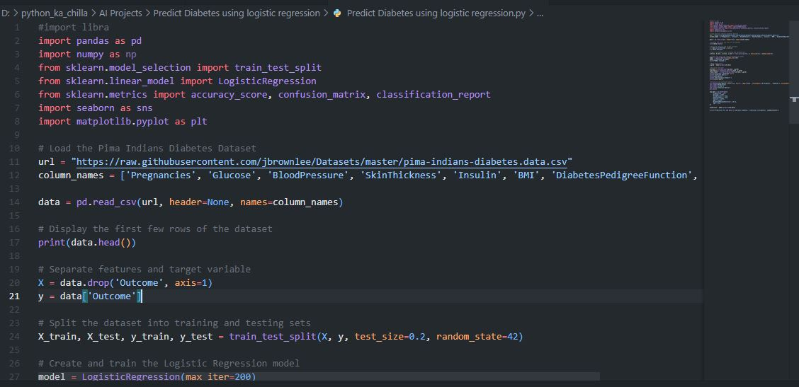
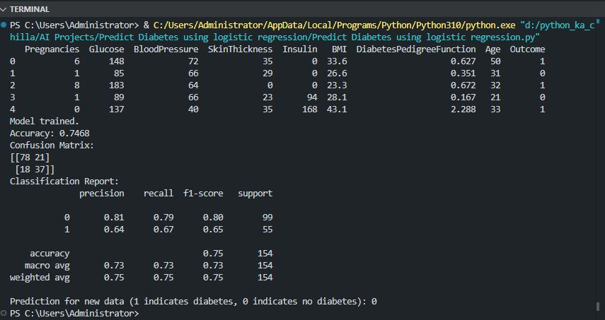
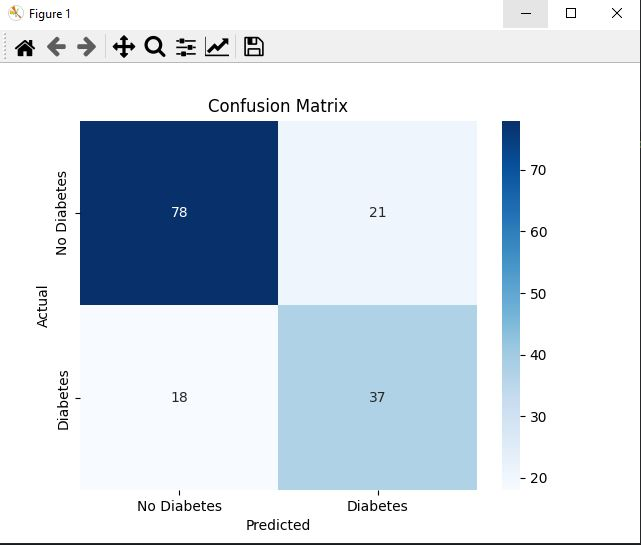

# 🩺 Diabetes Prediction using Logistic Regression 🤖  
      

<p align="center">
  
</p>

🚀 This project builds a **Logistic Regression** model to predict the likelihood of diabetes in patients using the **Pima Indians Diabetes Dataset**. It demonstrates a complete machine learning pipeline: data loading, exploratory analysis, train‑test split, model training, and evaluation using accuracy, confusion matrix, and classification report. A sample prediction on new data is also included.

---

## ✨ Key Features  
📊 **Real Dataset** – Uses the well‑known Pima Indians Diabetes dataset  
🧠 **Logistic Regression** – Simple yet interpretable classification algorithm  
📈 **Model Evaluation** – Accuracy, confusion matrix, and detailed classification report  
🎨 **Visualization** – Confusion matrix heatmap for performance insight  
🔮 **Prediction on New Data** – Example of using the trained model to predict a new patient  

---

## 🧠 Tech Stack  
- **Language:** Python 🐍  
- **Libraries:** pandas, numpy, scikit‑learn, matplotlib, seaborn  
- **Model:** Logistic Regression  
- **Evaluation:** Accuracy, Confusion Matrix, Classification Report  

---

## 📦 Installation  

```bash
git clone https://github.com/SayabArshad/Diabetes-Prediction-LogisticRegression.git
cd Diabetes-Prediction-LogisticRegression
pip install pandas numpy scikit-learn matplotlib seaborn
```

⚙️ Note: The dataset is loaded directly from a URL, so no additional download is required.

---

## ▶️ Usage

Run the main script:

```bash
python "Predict Diabetes using logistic regression.py"
```

The script will:

Load the Pima Indians Diabetes dataset.

Split the data into training (80%) and testing (20%) sets.

Train a Logistic Regression model.

Print accuracy, confusion matrix, and classification report.

Display a heatmap of the confusion matrix.

Predict diabetes for a sample new patient.

---

## 📁 Project Structure

```
Diabetes-Prediction-LogisticRegression/
│-- Predict Diabetes using logistic regression.py   
│-- README.md                                       
│-- assets/                                           
│    ├── code.JPG
│    ├── output.JPG
│    └── plot.JPG
```
---

## 🖼️ Interface Previews

| 📝 Code Snippet | 📊 Console Output |
|:---------------:|:-----------------:|
|  |  |

## 📈 Confusion Matrix Heatmap

Heatmap
https://assets/plot.JPG

---

## 💡 About the Project

Diabetes is a chronic disease that affects millions worldwide. Early prediction can help in timely intervention. This project uses logistic regression, a fundamental classification algorithm, to predict diabetes based on diagnostic measurements such as glucose level, BMI, age, etc. The Pima Indians Diabetes dataset contains 768 samples with 8 features. The model achieves about 75% accuracy and provides a solid baseline. The confusion matrix and classification report offer deeper insight into performance. The script also demonstrates how to make predictions on new patient data – a crucial step toward real‑world deployment.

---

## 🧑‍💻 Author

**Developed by:** [Sayab Arshad Soduzai](https://github.com/SayabArshad) 👨‍💻

📅 **Version:** 1.0.0

📜 **License:** MIT License


---

## ⭐ Contributions

Contributions are welcome! Fork the repository, open issues, or submit pull requests to enhance functionality (e.g., feature engineering, hyperparameter tuning, trying other algorithms).
If you find this project helpful, please ⭐ star the repository to show your support.

---

##  Contact

For queries, collaborations, or feedback, reach out at **[sayabarshad789@gmail.com](mailto:sayabarshad789@gmail.com)**


---

🩺 Predicting diabetes to enable proactive healthcare.

---
